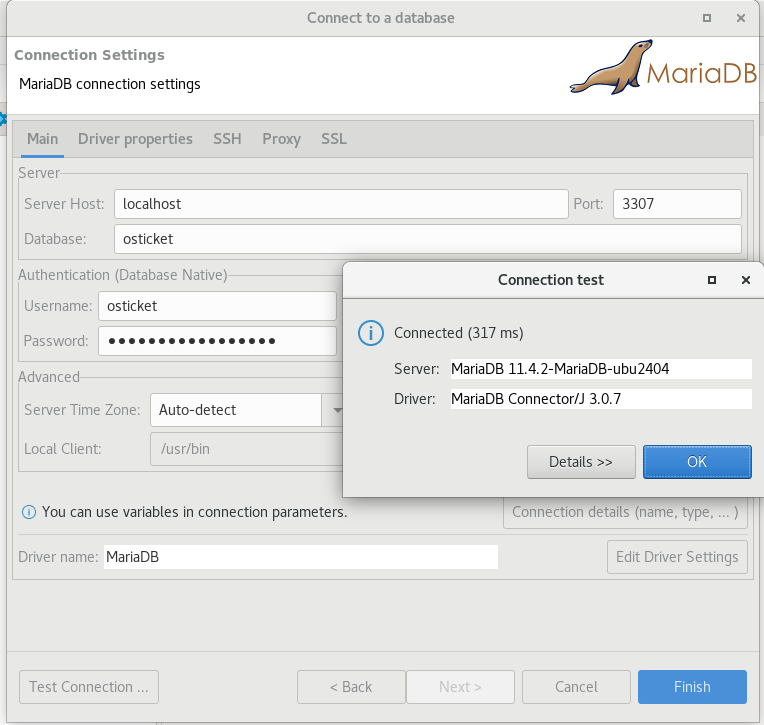
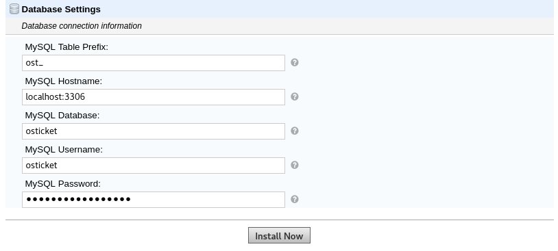

# osTicket Podman Compose

This repository provides a Podman Compose setup for running osTicket, an open-source support ticket system, using Podman containers.

## Table of Contents

- [Introduction](#introduction)
- [Features](#features)
- [Prerequisites](#prerequisites)
- [Installation](#installation)
- [Usage](#usage)
- [Contributing](#contributing)

## Introduction

osTicket is a widely-used open-source support ticket system. This repository allows you to quickly set up and run osTicket using Podman Compose, which is an alternative to Docker Compose for managing multi-container Podman applications.

## Features

- **Podman Compose Support:** Simplifies the deployment of osTicket using Podman containers.
- **Customizable:** Easily modify configurations and settings to suit your environment.
- **Scalable:** Manage multiple containers and services efficiently.

## Prerequisites

Before getting started, ensure you have the following installed:

- [Podman](https://podman.io/) and [Podman Compose](https://github.com/containers/podman-compose)
- Basic familiarity with Podman and containerized applications
- Recommended: Linux-based operating system (Podman's primary environment)

## Installation

1. Clone this repository:

   ```bash
   git clone https://github.com/0zymandia5/osTicket_podman_compose.git
   cd osTicket_podman_compose

   ```

## Usage

```
podman-compose -f podman-compose-osticket.yml up mariadb osticket
```

To build locally the osTicket image:

```
podman build -t <tag_name> .
```

Just keep on mind to replace de tag image from the podman-compose-osticket.yml .

To Connect to the database using a db client such as DBeaver.


To setup the mariadb database on OsTicket on your browser at: http://localhost:8080/osTicket/setup/install.php


## Contributing

Feel free to modify and expand upon this template based on your specific setup and preferences.
